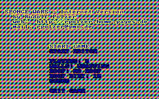
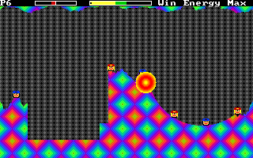
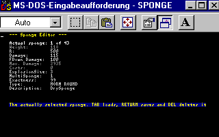

# Sponge Wars 2.2a ([Download](sponge.exe))

## Internet Version 2.2a

### Beschreibung:

Bei Sponge Wars geht es darum, den Gegner mit "Schwämmen" zu bewerfen.
Dieses Spielprinzip dürfte bekannt sein (eine ganz einfache Variante ist
GORILLA.BAS, aber Worms ist ein *kleines* ;-) Stück darüber). Dabei kann
man jedoch verschiedene "Schwämme" im EDITOR bearbeiten. So kann man
z.B. mit nassen, trockenen, TNT- und Spezialschwämmen werfen. Außerdem
werden die physikalischen Gesetze wie Reibung beachtet.

### Kommandozeilenparameter:

    /a-:      Kein Adlib-Sound
    /b-:      Kein SB-Sound
    /s-:      Kein Speaker-Sound (in der Win95-DOS-Box verwenden!)
    /dcreate: Bootdisk für Laufwerk A: erstellen (bei mir ohne Tastatur-
              treiber 620 kB konventioneller Speicher), ohne CD-ROM- oder
              ASPI-Treiber, nur HIMEM, EMM386 und eventuell KEYB GR

### Versionen:

    1.0  - eigentlich nur eine Beta
    1.1  - deutliche Verbesserungen (mit Editor)
    1.1a - Bugs mit Sound behoben, mit Speaker, quadratische Explosion
    1.2  - sternförmige Explosion, Speaker-Sounds verbessert
    1.2a - beschleunigt
    1.5ß - WAVes auch auf dem Speaker
    1.5  - Bug mit Speaker behoben (RTE 100), Intro-Wavefile, Sounds verbessert
    1.6  - Bug in Stefan Goehler's (ansonsten guter) SoundLib entdeckt
           (EMM386: Ungültiger DMA-Modus), jetzt mit E. Brodsky's SMIX,
           mehrere Sounds gleichzeitig, Sounds verbessert, alle Spieler
           fallen jetzt gleichzeitig, RAW- statt WAV-Dateien (kleiner),
           Sounds im XMS (mit SB), Font jetzt in Datei (soll Probleme
           gegeben haben...)
    geplant:
         - Autodetect der Soundkarte (nicht integriert, mit IRQ und PORT keine
           Probleme, wer weiß, wie man den DMA-Kanal der Soundkarte
           erkennt?
    1.8  - jetzt kann man sich auch bewegen! Einfach [TAB] vor dem Werfen drücken.
           Dann wird zuerst der entsprechende Schwamm geworfen. Anschließ 
           bewegt man sich an die Stelle, an der der Schwamm aufgekommen ist.
           Die Farbe des Doppelpfeils hat folgende Bedeutung:
           blau - man könnte sich mit diesem Schwamm bewegen (kostet nämlich
                  das Vierfache plus 10% der maximal möglichen Lebensenergie)
           gelb - man wird sich nach dem Werfen bewegen
           grau - man kann sich mit diesem Schwamm leider nicht bewegen (zu teuer...)
    2.0  - jetzt kann man auch in Teams spielen
    2.1a - ???
    2.2  - Release auf GitHub
    2.2a - Source-Code in Ordnung gebracht, FM-Sound durch Digital-Sound ersetzt

### Systemanforderungen:

#### Minimum:

-   486er Prozessor
-   etwa 300 kB freier Platz ;-)
-   MS-DOS 5.0+ oder DOS-Box
-   HIMEM.SYS
-   VGA-kompatible Grafikkarte (sind nicht alle, bei einer
    2D/3D-Kombikarte von einem Freund gab es Probleme)
-   PC-Quäker

#### Gut spielbar ab:

-   Pentium ab 133 MHz oder AMD K6
-   etwa 500 kB freier Platz :-)
-   MS-DOS oder MS-DOS-Modus
-   HIMEM.SYS
-   gute SVGA-Karte
-   Soundkarte mit BLASTER=A... I. D. Umgebungsvariable (macht Windoof
    ;-) normalerweise von alleine). Diese Variable kann mittels SoundSet
    (nicht empfohlen) eingestellt werden.
-   in dosbox: 10,000 cycles

### Tastenbelegung

#### Hauptmenü

|              |                           |
|--------------|---------------------------|
| Hoch/Runter  | Eintrag auswählen         |
| Links/Rechts | Zahlenwert einstellen     |
| Eingabe      | Umschalten oder Ausführen |

#### Spiel

|                        |                                     |
|------------------------|-------------------------------------|
| Links/Rechts           | Winkel, Feineinstellung             |
| --- mit Ctrl           | Winkel, Grobeinstellung             |
| Hoch/Runter            | Geschwindigkeit, Feineinstellung    |
| BildAuf/BildAb         | Geschwindigkeit, Grobeinstellung    |
| --- mit Ctrl           | Geschwindigkeit, Schnelleinstellung |
| +/-                    | Schwamm wählen                      |
| Leertaste              | W E R F E N ! ! !                   |
| beim Wurf / und \*     | Zeitraffer 1-10x                    |
| beim Wurf andere Taste | Zeitraffer 10x                      |
| \[E\]                  | Editor aufrufen                     |
| \[Esc\]                | Abbrechen und zum Hauptmenü         |

#### Editor

##### allgemein

|              |                  |
|--------------|------------------|
| Links/Rechts | Feineinstellung  |
| --- mit Ctrl | Grobeinstellung  |
| Hoch/Runter  | Wert auswählen   |
| \[ESC\]      | Zurück zum Spiel |

##### wenn auf 'SpongeNum' (erstes Feld)

|         |           |
|---------|-----------|
| \[TAB\] | Laden     |
| Eingabe | Speichern |
| Entf    | Löschen   |
